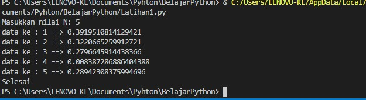

# Labpy03

Nama : Andriansyah

Nim : 312010011

Kelas : TI.20.B1

# Alur Algoritma latihan1.py

- lakukan kodingan seperti gambar di bawah ini

- Jika sudah kalian bisa save program kalian dengan tekan **CTRL+S** atau mengklik menu file - save as dan beri nama pada program kalian
- lalu menjalankan program kalian dengan menekan **f5** atau mengklik menu **RUN**
- Jika gagal silahkan cek kembali apakah kodingan kalian sudah seperti gambar diatas 👆
- Dan jika berhasil maka tampilan pada program python anda akan seperti ini 👇

- silahkan masukan nilai N nya,, setelah itu tekan enter maka hasilnya seperti ini

- Berikut penjelasan dari program diatas

input ("Masukkan nilai N: ")

import random

jumlah = 5

a = 0

for x in range(jumlah):

i = random.uniform(.0,.5)

a+=1

print('data ke:',a,'==>', i)

print ("selesai")

"input"  : berfungsi untuk mmemasukan data yang akan ditampilkan

"import" : fungsi lanjut yang dipanggil oleh statement import.

"random" : untuk menentukan suatu pilihan. 

"range"  : merupakan fungsi yang menghasilkan list. Fungsi ini akan menciptakan sebuah list baru dengan rentang nilai tertentu. 

"uniform": digunakan untuk menampilkan bilangan float random dengan batas awal bilangan x, dan batas akhir bilangan y.

# Alur Algoritma Latihan2.py

- lakukan kodingan seperti gambar di bawah ini

- Jika sudah kalian bisa save program kalian dengan tekan **CTRL+S** atau mengklik menu file - save as dan beri nama pada program kalian
- lalu menjalankan program kalian dengan menekan **f5** atau mengklik menu **RUN**
- Jika gagal silahkan cek kembali apakah kodingan kalian sudah seperti gambar diatas 👆
- Dan jika berhasil maka tampilan pada program python anda akan seperti ini 👇

- Berikut penjelas Latihan2.py

max=0

while True:

a=int(input("Masukkan bilangan="))

if max < a:

max = a

if a==0:

break

print("Bilangan terbesarnya adalah",max)

"max"	: fungsi bulid-in untuk mencari nilai tertinggi. Fungsi ini dapat diberikan sebuah parameter berupa angka.

"while"	: disebut uncounted loop (perulangan yang tak terhitung), untuk perulangan yang memiliki syarat dan tidak tentu berapa banyak 
perulangannya.

"int"	: berfungsi mengkonversi bilangan maupun string angka menjadi bilangan bulat (integer).

"if"	= Bila suatu kondisi tertentu tercapai maka apa yang harus dilakukan. Dengan fungsi ini kita bisa menjalankan suatu perintah dalam kondisi tertentu. 

"input"	: masukan yang kita berikan ke program.

"break"	: berfungsi untuk menghentikan operasi dibawahnya jika suatu kondisi yang ditentukan telah tercapai.

"print"	: berfungsi untuk mencetak atau menampilkan objek ke perangkat keluaran (layar) atau ke file teks.

# Alur Algoritma program1.py

Buat program sederhana dengan perulangan,

- Seorang pengusaha menginvestasikan uangnya untuk memulai usahanya
- Dengan modal awal 100 juta
- Pada bulan pertama dan kedua belum mendapatkan laba
- Pada bulan ketiga baru mulai mendapatkan laba sebesar 1%
- Pada bulan kelima pendapatan meningkat 5%
- Selanjutnya pada bulan ke-8 mengalami penurunan keuntungan sebesar 2%
- Sehingga laba menjadi 3%
- Hitung total keuntungan selama 8 bulan berjalan usahanya

 - lakukan kodingan seperti gambar di bawah ini

- Jika sudah kalian bisa save program kalian dengan tekan **CTRL+S** atau mengklik menu file - save as dan beri nama pada program kalian
- lalu menjalankan program kalian dengan menekan **f5** atau mengklik menu **RUN**
- Jika gagal silahkan cek kembali apakah kodingan kalian sudah seperti gambar diatas 👆
- Dan jika berhasil maka tampilan pada program python anda akan seperti ini 👇

- Berikut penjelasan dari Program1.py

- masukkan nilai a

- gunakan for untuk perulangan dari 1 sampai 8.Perulangan for disebut counted loop (perulangan yang terhitung)

- lalu gunakan if pertama untuk menentukan laba bulan ke 1 dan ke 2.masukan variabel (b) kalikan nilai (a) dengan data bulan 1 dan 2. cetak (x) dan (b)

- lalu gunakan if kedua untuk menentukan laba bulan ke 3 dan ke 4.masukan variabel (b) kalikan nilai (a) dengan data bulan 3 dan 4. cetak (x) dan (c)

- lalu gunakan if ketiga untuk menentukan laba bulan ke 5 sampai ke 7.masukan variabel (b) kalikan nilai (a) dengan data bulan 5 sampai 7. cetak (x) dan (d)

- lalu gunakan if keempat untuk menentukan laba bulan ke 8.masukan variabel (b) kalikan nilai (a) dengan data bulan 8. cetak (x) dan (e)

- lalu total keseluruhan.

- cetak total

Terimakasih Semangat Belajar
